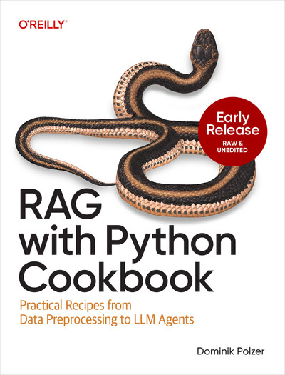

# RAG with Python Cookbook

<a href="https://www.linkedin.com/in/polzerdo/"></a>
<a href="https://learning.oreilly.com/library/view/rag-with-python/9798341600553/"></a>

Welcome! This repository contains the code for all examples in the O'Reilly book **[RAG with Python Cookbook](https://learning.oreilly.com/library/view/rag-with-python/9798341600553/)** written by [Dominik Polzer](https://www.linkedin.com/in/polzerdo/).

<a href="https://learning.oreilly.com/library/view/rag-with-python/9798341600553/"></a>

The book is a comprehensive, hands-on guide to building Retrieval-Augmented Generation (RAG) systems with Python. It is designed for developers, data scientists, and machine learning practitioners who want to:

- Load and preprocess diverse data types for RAG systems
- Generate and visualize text and image embeddings
- Store and search embeddings using vector databases
- Implement advanced retrieval techniques
- Build agentic and graph-based RAG systems
- Evaluate RAG systems with human and automated methods
- Build and deploy RAG-powered web applications

## Table of Contents

> [!TIP]
> All notebooks can be run directly in Google Colab — no local setup required. Click the badge next to each chapter to open it.

| Chapter | Title                                         | Colab Notebook / Source Link                                                                                                                                                                                                                                     |
| ------: | --------------------------------------------- | ---------------------------------------------------------------------------------------------------------------------------------------------------------------------------------------------------------------------------------------------------------------- |
|       1 | RAG Setup                                     | [](https://colab.research.google.com/github/polzerdo55862/RAG-with-Python-Cookbook/blob/main/ch01_RAG_intro/rag_basics.ipynb)                                                          |
|       2 | Generation and Prompt Engineering             | [](https://colab.research.google.com/github/polzerdo55862/RAG-with-Python-Cookbook/blob/main/ch02_generation/generation.ipynb)                                                         |
|       3 | Loading Data                                  | [](https://colab.research.google.com/github/polzerdo55862/RAG-with-Python-Cookbook/blob/main/ch03_loading_data/loading_data_to_RAG.ipynb)                                              |
|       4 | Data Preparation                              | [](https://colab.research.google.com/github/polzerdo55862/RAG-with-Python-Cookbook/blob/main/ch04_data_preparation_chunking_data/chunking_data.ipynb)                                  |
|       5 | Embeddings                                    | [](https://colab.research.google.com/github/polzerdo55862/RAG-with-Python-Cookbook/blob/main/ch05_text_embedding/text_embeddings.ipynb)                                                |
|       6 | Similarity Search                             | [](https://colab.research.google.com/github/polzerdo55862/RAG-with-Python-Cookbook/blob/main/ch06_similarity_search_vector_databases/vector_databases.ipynb)                           |
|       7 | Retrieval                                     | [](https://colab.research.google.com/github/polzerdo55862/RAG-with-Python-Cookbook/blob/main/ch07_retrieval/retrieval_techniques.ipynb)                                                |
|   **8** | **Agentic RAG**                               |                                                                                                                                                                                                                                                                  |
|     8.4 | ↳ Building an Agentic System Using Function Calling | [](https://colab.research.google.com/github/polzerdo55862/RAG-with-Python-Cookbook/blob/main/ch08_agentic_rag/8.4_building_agentic_system_function_calling/building_agents_without_framework.ipynb) |
|     8.5 | ↳ Accelerating Agents Using AsyncIO                 | [](https://github.com/polzerdo55862/RAG-with-Python-Cookbook/blob/main/ch08_agentic_rag/8.5_accelerating_agents_asyncio/book_snippet_asynchio.py)                                      |
|     8.6 | ↳ Building a Sales Negotiation Agent with OpenAI's Agents SDK | [](https://colab.research.google.com/github/polzerdo55862/RAG-with-Python-Cookbook/blob/main/ch08_agentic_rag/8.6_sales_negotiation_agent_openai_sdk/building_agents_with_openai_sdk.ipynb)                     |
|     8.7 | ↳ Enriching Your Agent's Capabilities with MCP Tools | [](https://github.com/polzerdo55862/RAG-with-Python-Cookbook/blob/main/ch08_agentic_rag/8.7_mcp_tools/01_connect_to_playwright.py)                                                   |
|     8.8 | ↳ Building an Agentic System Using LangGraph       | [](https://colab.research.google.com/github/polzerdo55862/RAG-with-Python-Cookbook/blob/main/ch08_agentic_rag/8.8_agentic_system_langgraph/building_agents_using_langgraph.ipynb)               |
|   **9** | **Graph RAG**                                 |                                                                                                                                                                                                                                                                  |
|     9.1 | ↳ Creating Your First Neo4j Knowledge Graph  | [](https://colab.research.google.com/github/polzerdo55862/RAG-with-Python-Cookbook/blob/main/ch09_graph_rag/9.1_basic_sla_graph.ipynb)                                            |
|     9.2 | ↳ Extending the Knowledge Graph with Structured Data | [](https://colab.research.google.com/github/polzerdo55862/RAG-with-Python-Cookbook/blob/main/ch09_graph_rag/9.2_enrich_company_data.ipynb)                                        |
|     9.3 | ↳ Building Your First Cypher Query            | [](https://colab.research.google.com/github/polzerdo55862/RAG-with-Python-Cookbook/blob/main/ch09_graph_rag/9.3_cypher_queries.ipynb)                                             |
|     9.4 | ↳ Enabling Semantic Search on a Neo4j Knowledge Graph | [](https://colab.research.google.com/github/polzerdo55862/RAG-with-Python-Cookbook/blob/main/ch09_graph_rag/9.4_embeddings_vector_search.ipynb)                                   |
|     9.5 | ↳ Optimize the Knowledge Graph for RAG Systems | [](https://colab.research.google.com/github/polzerdo55862/RAG-with-Python-Cookbook/blob/main/ch09_graph_rag/9.5_useful_extensions.ipynb)                                          |
|      10 | RAG Evaluation                                | [](https://colab.research.google.com/github/polzerdo55862/RAG-with-Python-Cookbook/blob/main/ch10_rag_evaluation/rag_evaluation_techniques.ipynb)                                      |
|  **11** | **RAG Chatbot (Streamlit)**                   |                                                                                                                                                                                                                                                                  |
|    11.1 | ↳ Building Your First Streamlit App          | [](https://github.com/polzerdo55862/RAG-with-Python-Cookbook/blob/main/ch11_rag_chatbot_streamlit/11.1_and_11.2_streamlit_chatbot_apps/03_simple_rag_app_2.py)                              |
|    11.2 | ↳ Building a Chatbot App Using Streamlit     | [](https://github.com/polzerdo55862/RAG-with-Python-Cookbook/blob/main/ch11_rag_chatbot_streamlit/11.1_and_11.2_streamlit_chatbot_apps/04_simple_rag_app_3.py)                              |
|    11.3 | ↳ Adding PDF Analyzer Functionality to Your Chatbot | [](https://github.com/polzerdo55862/RAG-with-Python-Cookbook/blob/main/ch11_rag_chatbot_streamlit/11.3_pdf_analyzer_functionality/entity_extraction_web_app.py)                  |
|    11.4 | ↳ Connect Your RAG App to a SQL Database     | [](https://github.com/polzerdo55862/RAG-with-Python-Cookbook/blob/main/ch11_rag_chatbot_streamlit/11.4_sql_database_connection/vanna_chat.py)                                              |
|    11.5 | ↳ Deploying Your Streamlit App Using Docker and AWS | [](https://github.com/polzerdo55862/RAG-with-Python-Cookbook/blob/main/ch11_rag_chatbot_streamlit/11.5_deploy_docker_aws/README.md)                                              |

## Book Outline

Explore the folders in this repository to find code examples and notebooks for each chapter and recipe. Contributions and feedback are welcome!

### Chapter 1: RAG Setup

[](https://colab.research.google.com/github/polzerdo55862/RAG-with-Python-Cookbook/blob/main/ch01_RAG_intro/rag_basics.ipynb)

- 1.1 Splitting Documents into Chunks
- 1.2 Generating and Storing Embeddings in ChromaDB
- 1.3 Querying the Vector Database for Relevant Context
- 1.4 Generating Answers Using an LLM

### Chapter 2: Generation and Prompt Engineering

[](https://colab.research.google.com/github/polzerdo55862/RAG-with-Python-Cookbook/blob/main/ch02_generation/generation.ipynb)

- 2.1 Designing an Effective Prompt Template
- 2.2 Calling the OpenAI Chat Completions API
- 2.3 Integrating an LLM into a RAG Pipeline
- 2.4 Transcribing Audio Using OpenAI Whisper
- 2.5 Calling the Anthropic API
- 2.6 Calling the Google Gemini API
- 2.7 Running Local LLMs Using Ollama
- 2.8 Comparing Outputs Across LLM Models
- 2.9 Extracting Structured Outputs Using Pydantic
- 2.10 Extracting Invoice Data Using Pydantic

### Chapter 3: Loading Data

[](https://colab.research.google.com/github/polzerdo55862/RAG-with-Python-Cookbook/blob/main/ch03_loading_data/loading_data_to_RAG.ipynb)

- 3.1 Loading Word Files in Python
- 3.2 Loading PDF Files
- 3.3 Loading and Handling Tabular Data from Excel Files
- 3.4 Loading Structured Data from a PostgreSQL Database
- 3.5 Loading Audio Files Using Speech-to-Text Models
- 3.6 Extracting Text from Images and PDFs Using Tesseract OCR
- 3.7 Extracting Text from Images Using Multimodal Models
- 3.8 Generating Text Description for Images Using Multimodal Models
- 3.9 Generating Text Summaries for Embedded Tables Using Multimodal Models
- 3.10 Parsing PDFs with Multiple Media Content Using Unstructured and Multimodal Models
- 3.11 Loading Videos Using Speech-to-Text and Multimodal Models

### Chapter 4: Data Preparation

[](https://colab.research.google.com/github/polzerdo55862/RAG-with-Python-Cookbook/blob/main/ch04_data_preparation_chunking_data/chunking_data.ipynb)

- 4.1 Adding Metadata to Enable Metadata Filtering
- 4.2 Enhancing Data Quality by Replacing Abbreviations and Technical Terms
- 4.3 Improving Search Accuracy by Embedding Hypothetical Questions
- 4.4 Splitting Documents Using Character Splitting
- 4.5 Splitting Documents Using Recursive Text Splitters
- 4.6 Document Aware Splitting
- 4.7 Splitting Text Using Semantic Aware Chunkers
- 4.8 Splitting Text Using Agentic Chunkers

### Chapter 5: Embeddings

[](https://colab.research.google.com/github/polzerdo55862/RAG-with-Python-Cookbook/blob/main/ch05_text_embedding/text_embeddings.ipynb)

- 5.1 Mapping Linguistic Meaning of Text Chunks to Numerical Representation
- 5.2 Visualizing Semantic Relationships by Reducing Dimensionality of Embedding Vectors
- 5.3 Calculating Distance Between Embeddings
- 5.4 Choosing the Right Embedding Model
- 5.5 Generating Embeddings for Images and Text Using CLIP
- 5.6 Performing Text Classification Using Embeddings
- 5.7 Improving Search Results Using a Hybrid Search Approach

### Chapter 6: Similarity Search

[](https://colab.research.google.com/github/polzerdo55862/RAG-with-Python-Cookbook/blob/main/ch06_similarity_search_vector_databases/vector_databases.ipynb)

- 6.1 Choosing the Right Vector Database
- 6.2 Storing and Searching Embeddings Using FAISS
- 6.3 Storing and Working with Embeddings in a Chroma Vector Database
- 6.4 Storing Embeddings in PostgreSQL Using the pgvector Extension
- 6.5 Performing Similarity Search in PostgreSQL
- 6.6 Speeding Up Vector Searches in PostgreSQL Using Indexing Techniques Supported by pgvector
- 6.7 Combining Keyword and Similarity Search for Better Results (Hybrid Search) with PostgreSQL

### Chapter 7: Retrieval

[](https://colab.research.google.com/github/polzerdo55862/RAG-with-Python-Cookbook/blob/main/ch07_retrieval/retrieval_techniques.ipynb)

- 7.1 Optimizing Query Results Using Metadata Filtering in PostgreSQL
- 7.2 Enhancing Search Results by Extending the Original Query with Generated Pseudo-Documents
- 7.3 Improving Search Results with Multi-Query Retrieval
- 7.4 Addressing Complex Requests by Designing a Query Routing System
- 7.5 Increasing Search Efficiency by Designing an Auto-Merging Retriever (Parent Document Retriever)
- 7.6 Increasing Search Results by Designing a Sentence Window Retriever
- 7.7 Improving Search Accuracy with Reranking Methods
- 7.8 Decomposing Complex Queries into Multiple Sub-Queries

### Chapter 8: Agentic RAG

[](https://github.com/polzerdo55862/RAG-with-Python-Cookbook/blob/main/ch08_agentic_rag)

- 8.4 Building an Agentic System Using Function Calling
- 8.5 Accelerating Agents Using AsyncIO
- 8.6 Building a Sales Negotiation Agent with OpenAI's Agents SDK
- 8.7 Enriching Your Agent's Capabilities with MCP Tools
- 8.8 Building an Agentic System Using LangGraph

### Chapter 9: Graph RAG

[](https://github.com/polzerdo55862/RAG-with-Python-Cookbook/blob/main/ch09_graph_rag)

- 9.1 Creating Your First Neo4j Knowledge Graph
- 9.2 Extending the Knowledge Graph with Structured Data
- 9.3 Building Your First Cypher Query
- 9.4 Enabling Semantic Search on a Neo4j Knowledge Graph
- 9.5 Optimize the Knowledge Graph for RAG Systems

### Chapter 10: Evaluation

- 10.1 Evaluating RAG Systems by Humans
- 10.2 Creating Synthetic Data for Automated Testing
- 10.3 Evaluating the Retriever Step by Calculating Context Precision@k
- 10.4 Evaluating RAG Systems Using LLMs as Judge and Faithfulness Metrics
- 10.5 RAG Evaluation Using Response Relevancy

### Chapter 11: RAG Chatbot

- 11.1 Building a Basic Weather Assistant Chatbot
- 11.2 Building a Multimodal PDF Analyzer App
- 11.3 Building a Data Analyst Chatbot Using the Text-to-SQL Approach
- 11.4 Deploying Your Streamlit App Using Docker and AWS
- 11.5 Incorporating Effective User Feedback Functionality

## Citation

Please consider citing the book if you find it useful for your research or projects:

```
@book{rag-with-python-cookbook,
  author    = {Dominik Polzer},
  title     = {RAG with Python Cookbook},
  publisher = {O'Reilly},
  year      = {2024},
  url       = {https://learning.oreilly.com/library/view/rag-with-python/9798341600553/},
  github    = {https://github.com/polzerdo55862/RAG-with-Python-Cookbook}
}
```
